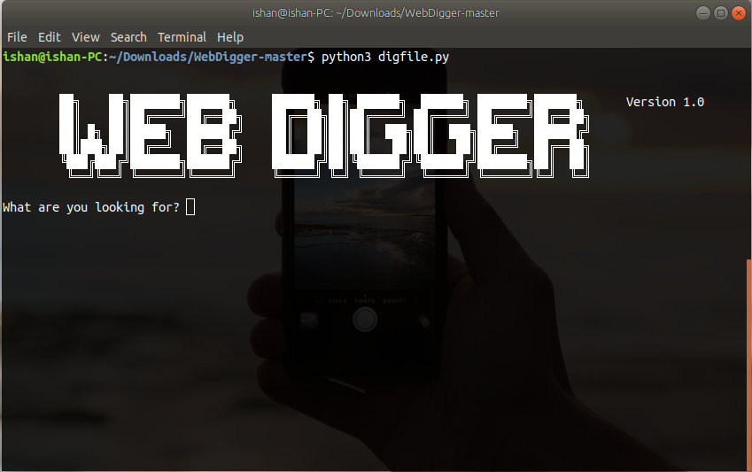
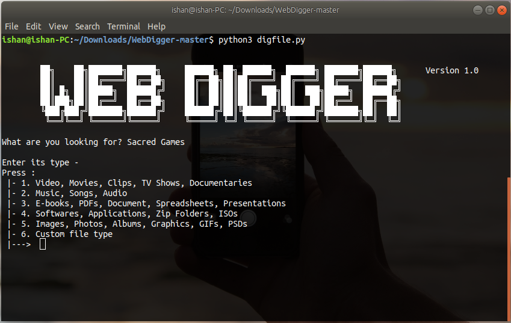
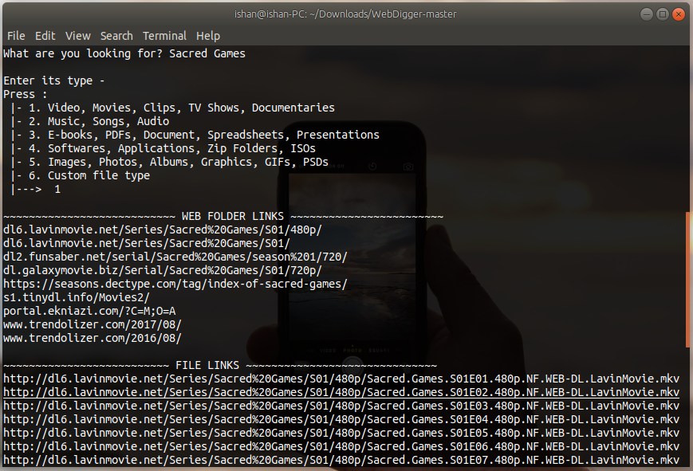
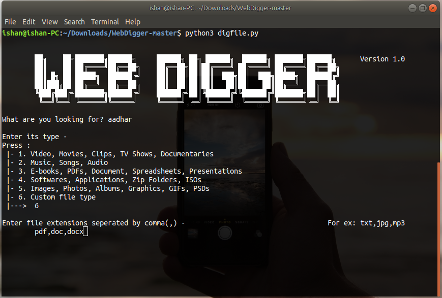
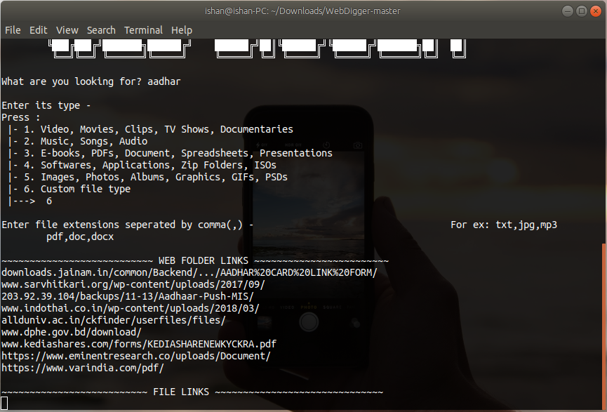

# WebDigger #
[]() []() []() []() []()

Web Digger helps you find files stored on web servers. Just tell it what you are looking for, and Web Digger will provide you the direct download links of file from different servers across the web. Be it anything from audio, video, document or application.

Executable version of the project is available here - http://www.thewebdigger.com


### Installation

- Linux
```sh
$ pip3 install -r requirements.txt
$ python3 digfile.py
```

- Windows
```sh
python -m pip install -r requirements.txt
python digfile.py
```

- Docker
```sh
$ docker pull visitishan/webdigger
$ docker run -ti visitishan/webdigger
```


### Screenshots












### Development

Want to contribute? Great!
